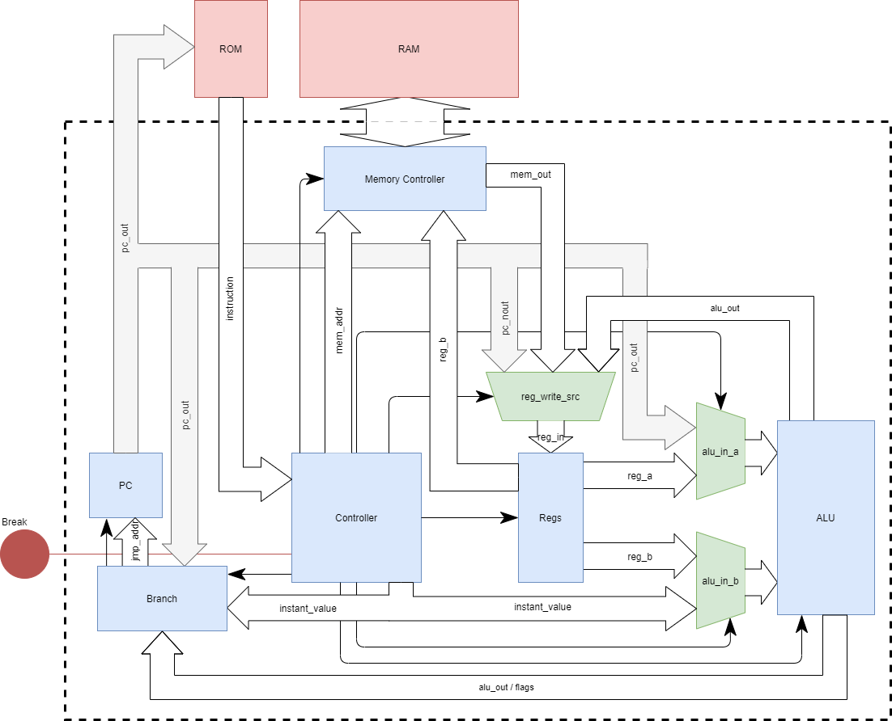

# RV32I Single Cycle

First attempt at programming a RISC-V single cycle core in Verilog.

This core implements the RV32I instruction set.

## Requirements
 * Icarus Verilog with SystemVerilog (IEEE1800-2012) support (version 11.0 and above) for compiling the core.
 * RISC-V GNU toolchain to compile the test program

## Testing
`make test` to build the core and testing program and run it on the core.

The test program is a simple ray-casting render that renders some spheres.
It can also render shadows and reflections, but it is disabled by default as
it may take several hours to render.

## Results
Running the test program required **5204013 clock cycles**. The resulting image
should look as follows with a 16x16 image.

The script `res/extract_raycast_result.py` can be used to reconstruct the previous
image from the memory dump.
